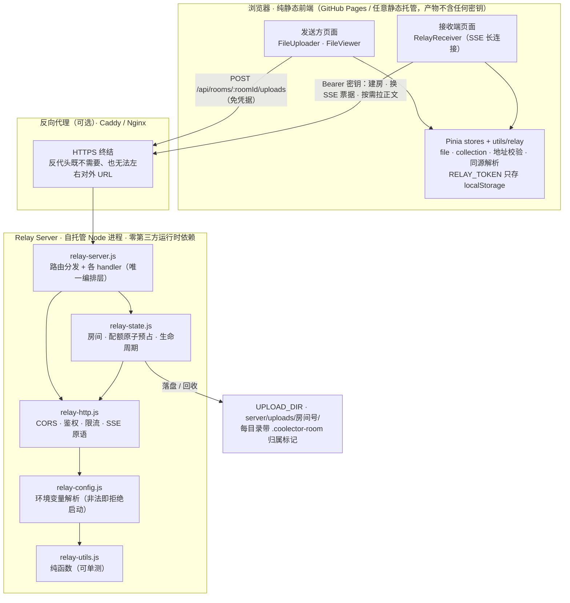
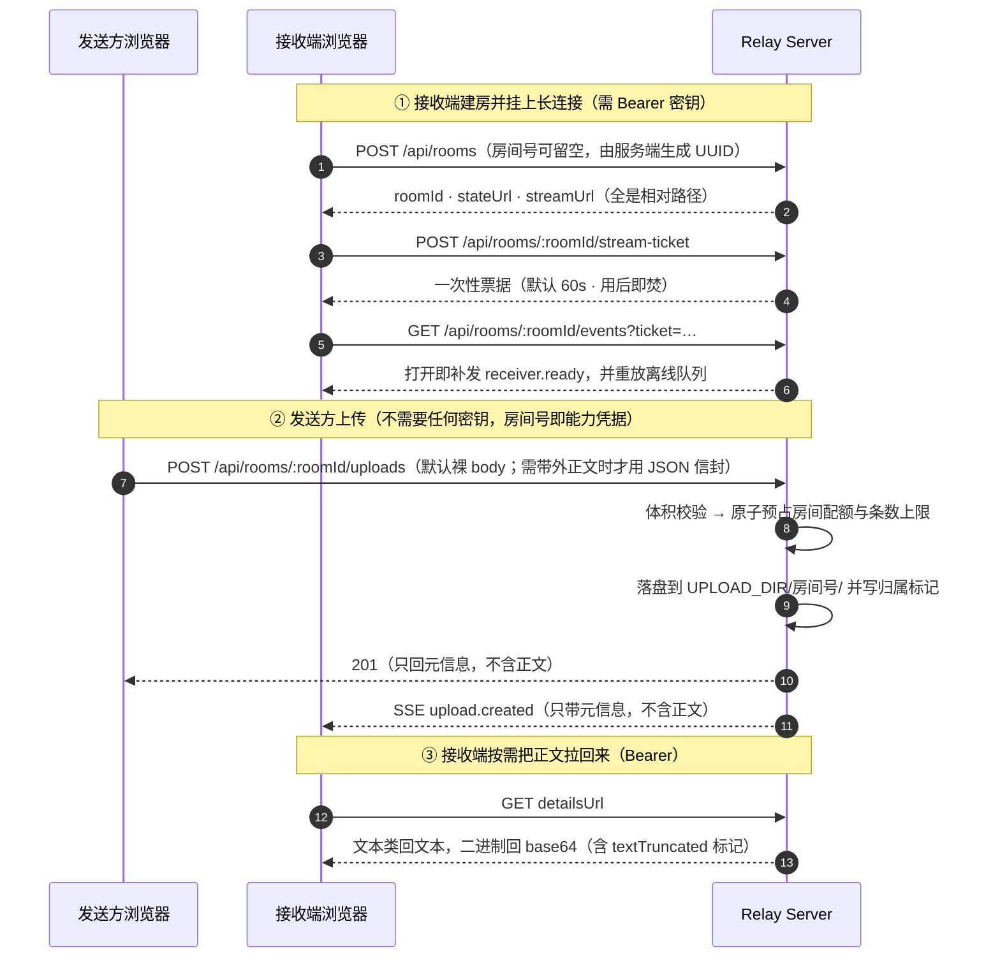

# Coolector


Coolector 是一个现代化的文件收集器。

## 主要功能

- [x] 文件上传
  - [x] 支持 .md, .ipynb, .docx
    - [x] .docx 自动解压读取正文，原始文件字节完整保留
  - [x] 支持批量上传
- [x] 拖拽上传和点击上传
- [x] 文件名校验
  - [x] 自定义文件名范式
  - [x] 校验文件名是否符合要求
- [x] 自动化文件信息提取
  - [x] 文件大小、类型、应用记录时间
  - [x] 从文件名中提取学号、姓名等信息
- [x] 读取收集名单并检查提交状态
- [x] 响应式设计
  - [x] 支持网页端
  - [x] 支持移动端

## 技术栈

- **前端框架**: Vue.js 3.5 (Composition API)
- **编程语言**: TypeScript 6.0+
- **状态管理**: Pinia 3.0+
- **构建工具**: Vite 8.0+
- **样式框架**: Tailwind CSS 4.0+
- **UI 组件**: 自定义组件 + Tailwind 工具类

## 开发指南

### 环境要求

- Node.js >=24.0
- pnpm >= 11.21.0

### 安装依赖

```bash
pnpm install
```

### 开发服务器

```bash
pnpm run dev
```

应用将在 <http://localhost:5174> 启动

### 快速启动前端和 Relay

```bash
pnpm start
```

默认同时启动：

- 前端应用：<http://localhost:5174>
- Relay Server：<http://localhost:8787>

可通过环境变量自定义端口：

```bash
APP_PORT=3000 RELAY_PORT=9000 pnpm start
```

### 构建项目

```bash
pnpm run build
```

构建产物将输出到 `dist/` 目录

### 预览构建结果

```bash
pnpm run preview
```

### 测试与门禁

改完代码请跑完整门禁；CI 会执行同一组命令。

```bash
pnpm test                # 单元测试（vitest）
pnpm lint                # oxlint，要求 0 warning / 0 error
pnpm check:atomic        # 并发不变量：配额/槽位的检查与扣减之间不得出现 await
pnpm exec vue-tsc -b     # 类型检查：src/ + vite.config.ts + server/ + shared/（pnpm build 已包含）
pnpm build               # 生产构建
pnpm guard:no-secret     # 断言构建产物中不含任何密钥（需先 build）
pnpm e2e                 # 真实浏览器端到端回归（会先 build）
```

`server/` 与 `shared/` 是原生 JavaScript，由 `tsconfig.server.json` 的 `checkJs` + `strict` 纳入
类型检查（生产代码全量受检；测试文件暂未纳入，理由见该配置内的注释）。因此给服务端函数补
JSDoc `@param` / `@returns` 是这条门禁的要求，而不是可选修饰。

`pnpm check:atomic` 是**本项目唯一反复复发的缺陷类**（配额 TOCTOU，曾把 4MB 房间打到 8.39×）
的可执行防线：它用 TypeScript 编译器 API 解析 `server/relay-state.js`，断言
`reserveStorageQuota` / `reserveUploadSlot` 的 JSDoc 带 `@atomic`、函数自身作用域内没有
`await`、且配额计数字段只在白名单函数里被写入。规则与判别力测试见
`scripts/check-atomic-invariants.mjs` 与 `server/relay-atomic-invariants.test.js`。

`pnpm e2e` 需要本机有 Chromium：`pnpm exec playwright install chromium`，
或用 `PLAYWRIGHT_CHROMIUM_EXECUTABLE` 指定已有的浏览器路径。
**它默认不会静默跳过** —— 静默跳过的门禁等于没有门禁；确实无法提供浏览器时，
可显式设置 `E2E_ALLOW_SKIP=1`。

> 为什么必须有浏览器回归：curl 不做请求头的 ISO-8859-1 校验，
> 因此「中文文件名让浏览器 `fetch` 在出网前抛 TypeError」这类主路径缺陷，
> 用 curl 冒烟是**必然看不见**的。`scripts/e2e-upload.mjs` 专门覆盖这条链路。

### 启动 Relay Server

```bash
pnpm run relay
```

默认监听 `http://localhost:8787`

## 软件架构

> 下图由 Mermaid 渲染，GitHub 与 VS Code 均原生支持；需要导出图片时可用 `mermaid-cli`。

### 组件与信任边界



三条结构性事实（也是全部安全设计的来源）：

1. **前端是纯静态站**：`dist/` 可直接公开托管，接收端密钥由用户在界面上填写、只存本机 `localStorage`，
   因此产物永远是公开安全的（`pnpm guard:no-secret` 会断言这一点）。
2. **Relay Server 是唯一有状态方**：房间只在内存、正文只落磁盘；无 Redis / 无数据库 / 无第三方运行时依赖，
   单实例即可服务多个班级，但也**不支持多实例共享 `UPLOAD_DIR`**。
3. **服务端只输出相对路径**：`Host` / `X-Forwarded-*` 完全不参与 URL 拼接，由客户端按自己填写的 Relay 地址解析 ——
   否则无凭据的发送方伪造 `Host` 就能把接收端的管理密钥引向攻击者域。

### 两条主链路



> 为什么 SSE 只推元信息：单文件上限 10 MB，正文广播会按接收端数量成倍放大内存与流量；
> 正文一律走 `detailsUrl` 按需拉取，`download` 端点则直接从磁盘读回。
>
> **201 与 SSE 广播口径一致：只回元信息，不含正文**。发送方刚把这些字节发上来，回显只是让它
> 再下载一遍 —— 实测一次 10 MB 上传在回显形态下往返 **24.47 MB**（上行 10.49 + 下行 13.98），
> 响应比请求还大；去掉回显后往返降到 **10.49 MB**，服务端单次上传的峰值内存从 **43.4 MB**
> 降到 **10.1 MB**。文本类文件另有 1 MB 的 `contentText` 一层，同样已去掉。
> 需要正文的一方（只有接收端）走 `detailsUrl`，它需要 Bearer 凭据。

## 项目结构

```text
server/
├── relay-server.js     # Relay 主服务：路由分发与各 handler（Node 原生 http）
├── relay-config.js     # 环境变量解析（非法值 fail-closed 退出）
├── relay-http.js       # HTTP 原语与准入（CORS / 鉴权 / 限流 / 读写）
├── relay-state.js      # 房间状态、配额记账与生命周期
├── *.test.js           # 纯函数单测 + 真实进程 HTTP 集成测试
└── start.js            # web + relay 双进程编排
scripts/
├── e2e-upload.mjs      # 真实浏览器端到端回归（G3 门禁）
├── check-no-secrets.mjs# 构建产物密钥泄露守卫
└── receiver.mjs        # 内网穿透一键编排（本机当接收端）
src/
├── components/          # Vue 组件
│   ├── FileUploader.vue    # 文件上传组件
│   ├── CollectionStatus.vue # 收集状态组件
│   ├── FileViewer.vue      # 文件预览 / 发送方上传
│   ├── RelayReceiver.vue   # 公网接收长连接（SSE）
│   └── ToastHost.vue       # 全局提示宿主
├── composables/        # 组合式函数（useToast / useRelayReceiver）
├── stores/             # Pinia 状态管理（file / collection）
├── utils/              # 文件名解析、docx 解析、格式化、relay 凭据与契约类型
├── App.vue            # 根组件
├── main.ts            # 应用入口
└── style.css          # 全局样式
```

## 核心功能

### 文件上传

- [x] 支持拖拽上传和点击上传
- [x] 支持多文件同时上传
- [x] 显示文件大小、类型等信息

### 收集名单管理

- [x] 上传包含文件名的列表文件
- [x] 实时跟踪收集进度
- [x] 状态标记：待收集、已收集、错误
- [x] 可视化进度条显示

### 文件预览

- [x] 查看上传文件的内容
- [x] 标记文件为已收集状态
- [x] 显示文件详细信息

## 跨公网传输

- [x] 公网 Relay Server
- [x] Receiver 长连接
- [x] HTTP 上传
- [x] Relay 内存转发
- [x] 服务端保存并下载客户端上传文件

Relay 收到客户端上传后会把文件保存到 `server/uploads/<roomId>/`，并返回可下载地址：

```text
GET /api/rooms/:roomId/uploads/:uploadId?download=1
```

也可以通过房间状态查看上传文件和下载链接（需携带接收端密钥）：

```bash
curl -H "Authorization: Bearer $RELAY_TOKEN" http://localhost:8787/api/rooms/<roomId>
```

### 上传请求的两种形态

`POST /api/rooms/:roomId/uploads` 接受两种请求体：

- **裸 body（内置前端走这条）**：正文即文件原始字节，元信息走 URL 或请求头。**不做任何 base64**
  —— 相比信封省掉 33% 带宽与客户端主线程上的编码开销。
- **JSON 信封**：元信息与 base64 正文都在 body 里，须**显式**带 `X-Relay-Envelope: 1`
  —— 否则正文本身就是 JSON 的 `.json` / `.ipynb` 会被误判成信封。
  内置前端仅在**必须携带带外数据**时才用：`.docx` 的客户端提取正文（裸 body 没有位置放它），
  以及中继接收来的文件（本地只剩 base64，没有原始字节）。

裸 body 形态的文件名以 **`?name=<百分号编码的 UTF-8>` 为准**，其次才是 `X-Relay-Filename` 头：

```bash
# %E4%BD%9C%E4%B8%9A.docx 即「作业.docx」
curl -X POST "http://localhost:8787/api/rooms/<roomId>/uploads?name=%E4%BD%9C%E4%B8%9A.docx" \
  --data-binary @作业.docx
```

> HTTP 头值只接受 ISO-8859-1，所以 `X-Relay-Filename` 只适合 curl 直接写 UTF-8 字节的形态。
> 该头**也**接受百分号编码，但**仅当解出来确实含非 ASCII 字符时**才解码 ——
> `note%20f.md` 这类纯 ASCII 的 `%XX` 原样保留，不会被人为改成另一个文件名。
> 文件名里**本来就含** `%XX` 时，用 `?name=` 写双重编码（`note%2520f.md`）精确表达。

### 鉴权模型（重要）

- **接收端**持有管理密钥 `RELAY_TOKEN`：建房、查状态、签发 SSE 票据、删除房间都需要它。
  密钥**只保存在浏览器本机 `localStorage`**，由用户在「公网接收长连接」面板填写，绝不随前端产物分发。
- **发送方不需要任何密钥**：只需知道房间号即可上传。房间号是服务端生成的完整 UUID，
  **它本身就是能力凭据**，因此不要公开张贴 —— 只说给该交作业的人。
- **SSE 不回退到 URL token**：`EventSource` 无法自定义请求头，接收端先用
  `POST /api/rooms/:roomId/stream-ticket` 换一次性短时效票据（默认 60 秒、用后即焚）。

> 变更影响：`POST /api/rooms/:roomId/uploads` 不再「上传即建房」。房间必须由接收端先创建，
> 否则上传返回 404 —— 过去发送方落进没有接收端的房间等于进了黑洞，且允许自造房间号无限建房。
> 升级顺序建议 **先前端后 Relay**：新前端默认走裸 body 且不带凭据，旧 Relay 本来就支持这条通道
> （`?name=` 由 `URLSearchParams` 解码），因此不会出现「前端已升级、上传全失败」的窗口；
> 反向（先 Relay 后前端）同样安全。

> **公网部署**：Relay Server 是有状态服务，CI 只部署静态前端，**需自行托管才能公网可达**。
> 完整部署清单（反向代理 / 环境变量 / 安全）见 [RELAY_DEPLOY.md](./RELAY_DEPLOY.md)。
> 部署到公网时务必设置 `RELAY_TOKEN` 与 `RELAY_ALLOWED_ORIGINS`，并强制 HTTPS。
> 反代后**无需**任何额外配置：服务端对外只返回相对路径，接收端按它自己填写的 Relay 地址
> 解析，因此不会出现混合内容。服务端刻意**不**从 `Host` / `x-forwarded-*` 推断自身地址
> （那会让无凭据的发送方用伪造 `Host` 把接收端的管理密钥引向攻击者域）。
> 仅当有非浏览器客户端需要绝对 URL 时才设 `RELAY_PUBLIC_BASE_URL`。
> **未设置 `RELAY_TOKEN` 且监听非回环地址时，Relay 会拒绝启动（fail-closed）**；
> `pnpm start` 在这种情况会**强制**把 relay 回退到 `127.0.0.1` 并打印提示，
> 因此新克隆仓库直接 `pnpm start` 即可本地跑起来，不会整栈退出。

### 运行期语义（务必知悉）

- **房间与上传都只存在于内存 / 本地磁盘，重启即失效**：重启后旧房间一律 404，
  接收端需要重新建房并把新的房间号发给发送方。服务启动时会回收磁盘上残留的
  「无主上传目录」（`RELAY_KEEP_ORPHAN_UPLOADS=true` 可改为保留），
  否则它们会被永久计入磁盘配额却无法回收。
  回收是**可判定**的：只删「目录内含本程序写的归属标记 `.coolector-room` 且标记 roomId 与目录名一致」
  的目录；无标记的目录一律不删、也不计入配额，并在启动日志里列出 ——
  因此 `UPLOAD_DIR` 即使指向共享数据根也不会误删无关数据。
- **配额按房间计**（`MAX_ROOM_UPLOAD_BYTES`，默认全局的 1/8）：
  免凭据的发送方只能填满自己那个房间，不会把全局配额吃光导致其它班级一起失败。
  计费口径是「正文 + 元数据 + 服务端保留的文本字段」，文本类文件约为文件大小的 2 倍。
- **房间有绝对存活上限**（`ROOM_MAX_LIFETIME_MS`，默认 24h），即使接收端一直连着也会到点回收。
- **多实例不能共享 `UPLOAD_DIR`**：新实例启动时会回收它看到的带标记目录（含在跑实例的在线房间）。

## 使用说明

1. **上传文件**: 点击或拖拽文件到上传区域
2. **上传收集名单**: 上传包含目标文件名的文本文件
3. **查看收集状态**: 实时查看收集进度和状态
4. **预览文件**: 点击文件查看详细内容
5. **标记完成**: 在文件预览中标记为已收集

## 开发特性

- 🎯 完整的 TypeScript 类型支持
- 🎨 现代化的响应式设计
- ⚡ 快速的开发体验（Vite HMR）
- 📱 移动端友好的界面
- 🔧 模块化的组件架构
- 📊 实时的状态管理
